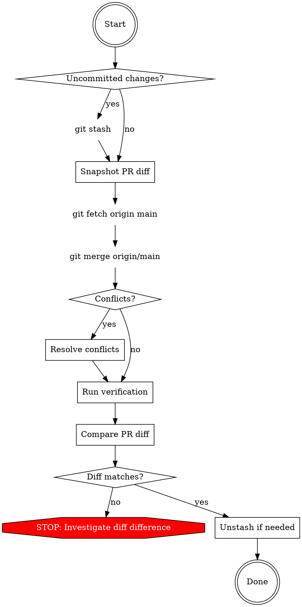

# Sync Main into Feature Branch

## Overview

Safely merge latest main into the current feature branch, resolve conflicts, and verify PR functionality is unchanged. Core principle: **snapshot before, verify after**.

## When to Use

- Branch is behind main and needs updating
- CI fails due to main divergence
- Before final PR review to ensure compatibility
- After long-running feature work

## Process



## Step-by-Step

### 1. Safeguard uncommitted work

```bash
git status
# If dirty:
git stash --include-untracked
```

### 2. Snapshot the PR diff (critical)

Save what your PR changes relative to main **before** merging:

```bash
git diff origin/main...HEAD > /tmp/pr-diff-before.patch
git diff --stat origin/main...HEAD > /tmp/pr-stat-before.txt
```

The three-dot diff (`...`) shows only your branch's changes, excluding main's. This is your baseline.

### 3. Fetch and merge

```bash
git fetch origin main
git merge origin/main
```

If no conflicts, skip to step 5.

### 4. Resolve conflicts

For each conflicted file:

```bash
# List conflicts
git diff --name-only --diff-filter=U

# For each file, understand both sides:
git show origin/main:<path>   # What main changed
git show HEAD:<path>          # What your branch has (pre-merge HEAD)
git log --oneline origin/main...HEAD -- <path>  # Commits touching this file from both sides
```

**Resolution strategy:**
- **Both sides changed different parts** — keep both changes (git usually auto-merges; if not, combine manually)
- **Both sides changed the same code** — your PR's intent takes priority; adapt it to work with main's new context
- **Main refactored/moved code your PR also touches** — apply your PR's logical change on top of main's new structure
- **Main deleted code your PR modified** — investigate why; if intentional, adapt your change to the new approach

After resolving each file:
```bash
git add <path>
```

Finalize:
```bash
git commit  # Accept default merge message
```

### 5. Verify quality

Run the project's full quality suite:
```bash
make check-all
make test
```

Fix any failures — they indicate conflict resolution errors or API changes in main that need adaptation.

### 6. Compare PR diff (critical)

```bash
git diff origin/main...HEAD > /tmp/pr-diff-after.patch
git diff --stat origin/main...HEAD > /tmp/pr-stat-after.txt

# Compare:
diff /tmp/pr-stat-before.txt /tmp/pr-stat-after.txt
```

**What to check:**
- Same files modified in both snapshots
- No files from your PR disappeared
- No unexpected new files appeared (beyond merge artifacts)
- Line counts are similar (small differences are expected if you adapted to main's changes)

If the stat diff shows unexpected changes, compare the full patches:
```bash
diff /tmp/pr-diff-before.patch /tmp/pr-diff-after.patch
```
Investigate any differences before proceeding.

### 7. Restore stashed work

```bash
# Only if you stashed in step 1:
git stash pop
```

## Quick Reference

| Step | Command | Purpose |
|------|---------|---------|
| Safeguard | `git stash --include-untracked` | Protect uncommitted work |
| Snapshot | `git diff origin/main...HEAD > /tmp/pr-diff-before.patch` | Baseline PR changes |
| Fetch | `git fetch origin main` | Get latest main |
| Merge | `git merge origin/main` | Integrate main |
| Conflicts | `git diff --name-only --diff-filter=U` | List conflicted files |
| Context | `git show origin/main:<path>` | See main's version |
| Verify | `make check-all && make test` | Quality gates |
| Compare | `diff /tmp/pr-stat-before.txt /tmp/pr-stat-after.txt` | Confirm PR intact |

## Common Mistakes

| Mistake | Fix |
|---------|-----|
| Merging without snapshotting PR diff first | Always capture `origin/main...HEAD` diff before merge |
| Resolving conflicts by blindly accepting "ours" or "theirs" | Understand both sides; combine intent |
| Skipping tests after merge | Conflicts may compile but break logic |
| Force-pushing after merge | Never force-push; merge commits are additive |
| Not comparing before/after PR diff | The whole point is preserving PR functionality |
